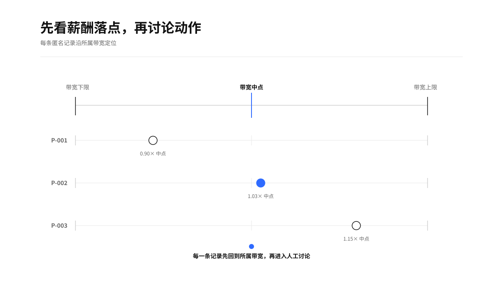
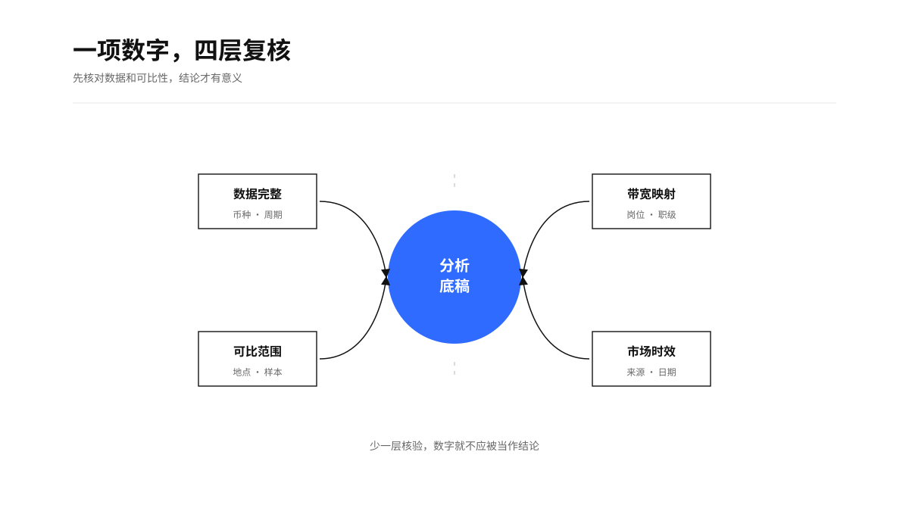
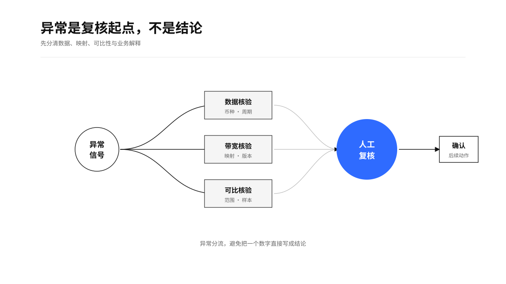
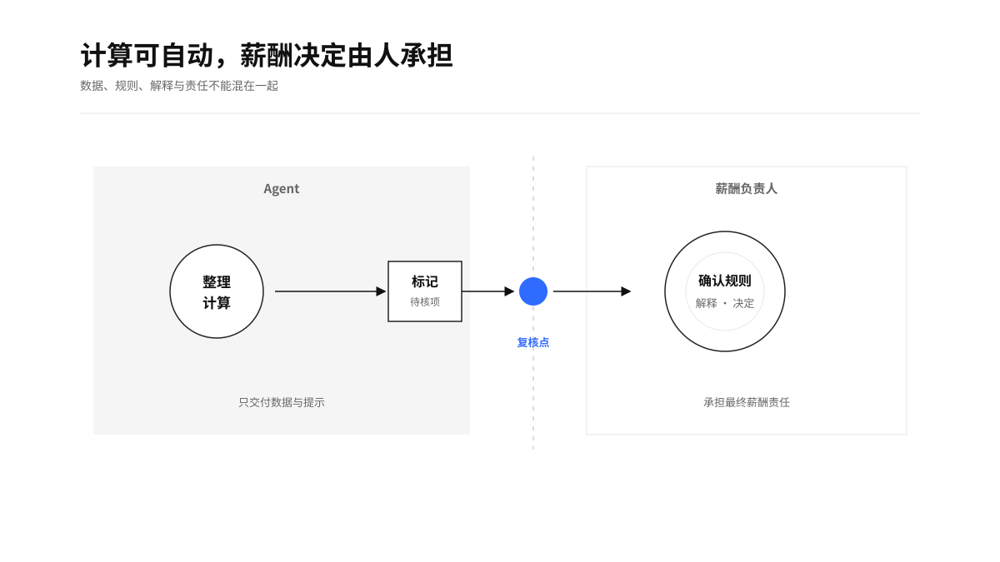

<h1 align="center">薪酬结构分析</h1>

<p align="center">
  <a href="https://github.com/TongyiDai/hr-compensation-analysis/actions/workflows/ci.yml"></a>
  
  
  =3.8">
  
</p>

`hr-compensation-analysis`

一个可本地运行、可复核、面向所有 Agent 的中文薪酬结构分析 Skill。它从脱敏薪酬材料生成带宽位置、数据缺口与人工复核底稿；飞书或 HRIS 只是可选输入源。

## 价值与适用场景

薪酬讨论最容易失真在两个地方：口径混在一起，数据结论被误读成决定。这个 Skill 把薪酬带宽、个人匿名位置、市场数据时效和待核事项放在同一份分析包里，帮助 HR、业务负责人和薪酬团队围绕同一组事实讨论。

适用于年度调薪、晋升与预算讨论前的结构盘点；岗位/职级/地点带宽映射检查；薪酬数据清理；带宽外记录复核；以及 HR 已提供的市场数据汇总。它不需要飞书接口，本地表格、文件、邮件、消息或 HR 提供的材料都可以作为输入。

<p align="center">
  
</p>

## 这个 Skill 产出什么

- 分析目的、货币、周期、材料来源与时效。
- 匿名记录的基础薪资、compa-ratio、range penetration 和带宽位置。
- 按带宽的样本量、平均值、中位数和带宽外数量。
- HR 提供的市场数据及其来源、日期与口径。
- 带宽外、样本过小、映射或数据缺失的待复核队列。
- 数据事实、已知解释、待验证项与人工决策点的清晰分隔。

<p align="center">
  
</p>

## Agent 使用须知

本 Skill 适用于所有能读取 `SKILL.md`、处理用户授权材料并执行本地 Python 的 Agent。Agent 先确认分析目的、薪酬口径、币种、周期、可比范围和材料时效；优先使用用户当前消息与本地脱敏材料；外部系统只在用户明确要求时接入。

默认只读。任何表格写回、HRIS 修改、消息或审批动作都需要单独确认，并在写后读回验证。完整运行契约见 [AGENT-GUIDE.md](AGENT-GUIDE.md)。

## 快速开始

### 使用仓库中的虚构脱敏数据

```bash
python3 scripts/build_comp_analysis.py \
  --input tests/fixtures/engineering-bands.json \
  --format markdown \
  --output /tmp/compensation-analysis.md
```

### 使用本地或用户提供的材料

先将材料归一化成脱敏 JSON，再生成报告：

```bash
python3 scripts/build_comp_analysis.py \
  --input /path/to/anonymized-compensation-data.json \
  --format json \
  --output /tmp/compensation-analysis.json
```

字段定义见 [输入结构](references/input-schema.md)，整理规则见 [材料整理](references/material-intake.md)。

### 使用飞书材料（可选）

```bash
lark-cli auth status --json --verify
lark-cli sheets +cells-get --url "https://example.feishu.cn/sheets/shtXXXX" \
  --sheet-name "脱敏薪酬带宽" --range "A1:Z200" --include value,formula --as user --json
```

支持 `auth status --json --verify` 的环境必须确认 `identity=user`、`verified=true`。当前 CLI 构建若没有 `auth` 子命令，可退回 `contact +get-user --as user` 或 `task +get-my-tasks --as user` 做只读兼容探测。飞书只用于读取用户明确授权的脱敏表格。没有飞书接口时，直接使用本地或用户提供材料即可。

## 如何看结果

`compa-ratio` 描述基础薪资相对带宽中点的位置；`range penetration` 描述它在下限到上限之间的位置。二者只在岗位、职级、地点、币种和周期可比时有效。

带宽外记录、群体差异、样本过小或市场数据过期都会进入待复核队列。它们是开始调查的信号，不能自动变成调薪、合规、公平、晋升或留任判断。

<p align="center">
  
</p>

## 安全边界

- 默认只处理匿名 `person_ref`、岗位、职级、地点、带宽和基础薪资。
- 不处理姓名、联系方式、受保护属性、家庭、健康、薪酬历史或原始绩效材料。
- 不编造市场数据，也不把不同来源、币种或周期伪装成可比数据。
- 不直接给个人定薪、调薪金额、晋升、裁员、法律或公平结论。
- 人类负责人确认规则、解释差异并承担最终薪酬决定。

<p align="center">
  
</p>

## 验证

```bash
python3 -m unittest discover -s tests -p 'test_*.py'
# 可选：若本机已安装 skill-creator 工具，可额外校验 SKILL.md frontmatter
# python3 "$SKILL_CREATOR/scripts/quick_validate.py" .
```

## 上游与许可证

本项目以 [Anthropic Human Resources Plugin](https://github.com/anthropics/knowledge-work-plugins/tree/658e077ffd7bdd50a12c19ec5ff36fe34c88be8a/human-resources) 的 `comp-analysis` 为上游参考，并吸收 [SAP compa-ratio](https://help.sap.com/docs/successfactors-employee-central/implementing-employee-compensation-data/compa-ratio) 与 [EEOC 薪酬分析指引](https://www.eeoc.gov/laws/guidance/section-10-compensation-discrimination) 的公开原则。差异和许可证见 [UPSTREAM.md](UPSTREAM.md)。
